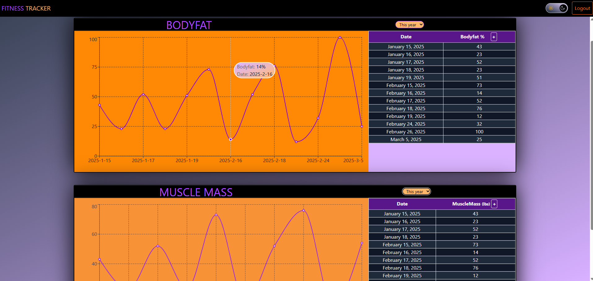

# 🏋️‍♂️ Fitness Tracker Web App

A full-stack fitness tracking application built using the MERN stack and MySQL. Users can log and visualize body fat percentage and muscle mass over time.

## 🚀 Features

- Secure user authentication (bcrypt + sessions)
- Line chart visualization of fitness data (Recharts)
- Date-filtered data view (month/year/all-time)
- Responsive UI with dark/light mode toggle
- MySQL backend with connection pooling

## 📸 Preview



## 🔧 Tech Stack

- **Frontend**: React (Vite), Bootstrap
- **Backend**: Express.js, Node.js
- **Database**: MySQL
- **Charting**: Recharts
- **Authentication**: bcrypt

## 📂 Folder Structure

client/ // React frontend
server/ // Express backend
db/ // SQL scripts and config

## 📌 Getting Started

# 1. Clone the repo

# 2. 🗄️ Database Setup

This project uses MySQL for data storage. Follow the steps below to set up the database:

## 📦 Requirements

- MySQL server (local or remote)
- MySQL Workbench or CLI

## 🔧 Steps

1. Open MySQL Workbench
2. Run `schema.sql` to create the `fitness_tracker` DB and tables
3. (Optional) Run `seed.sql` to populate with sample data

Alternatively, from the CLI:

```bash
mysql -u root -p < schema.sql
mysql -u root -p < seed.sql  # if you want test data
```

# 3. Run the Client and Server
`cd client && npm install && npm run dev`  
`cd server && npm install && npm start`
